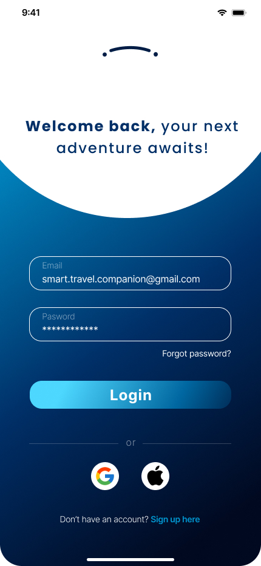
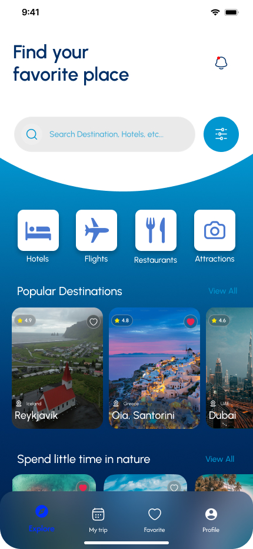
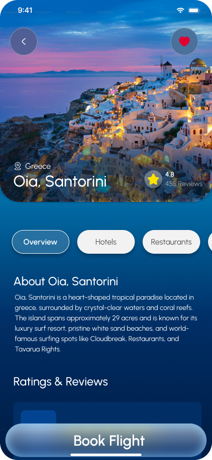
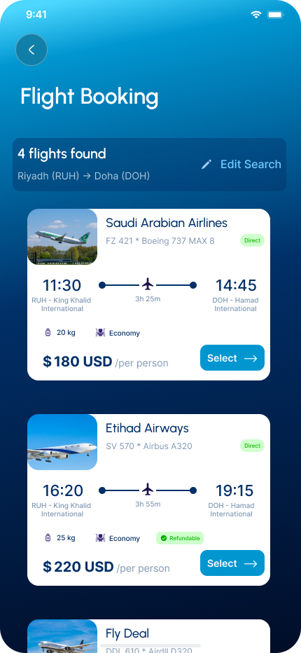
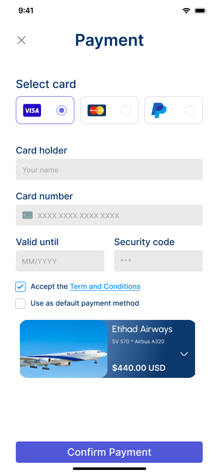

# TOM Travel App – UI / UX Design

This folder contains the UI/UX design work for the TOM Travel App, created using **Figma**.

The design focuses on providing a clean, modern, and user-friendly experience, with attention to layout consistency, visual hierarchy, and smooth user interaction.

## Design Process

- High-fidelity UI design created directly in Figma
- Reusable components and consistent design system
- Interactive transitions and screen-to-screen animations
- Real-world focused layouts aligned with mobile app usability

Low-fidelity wireframes were not created separately; instead, the design was developed directly as a complete interactive prototype.

## Screens Preview

### Splash Screen

### Login Screen

### Explore Screen

### Destination Screen

### Flight_Booking Screen

### Payment Screen

## Figma Link
🔗 https://www.figma.com/design/boLRXISvvWJSf15HL7KsDH/Smart-Travel-App?node-id=814-3273&t=l9eND0VjhzjBRMze-1

